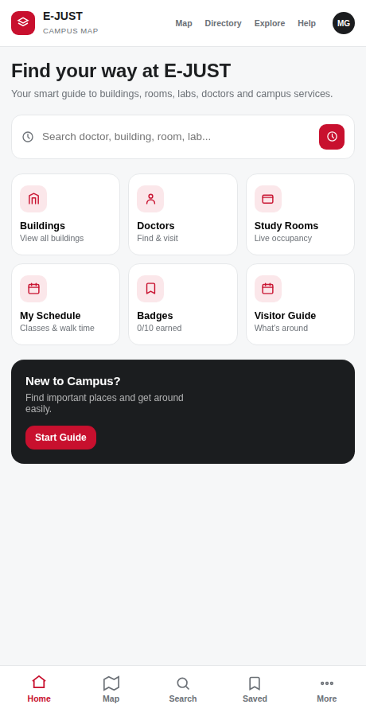
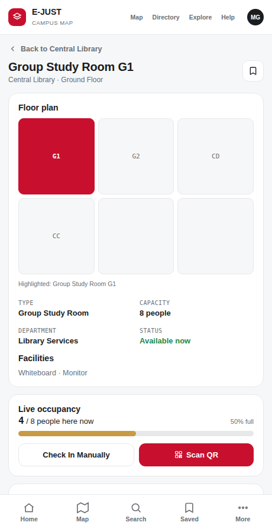
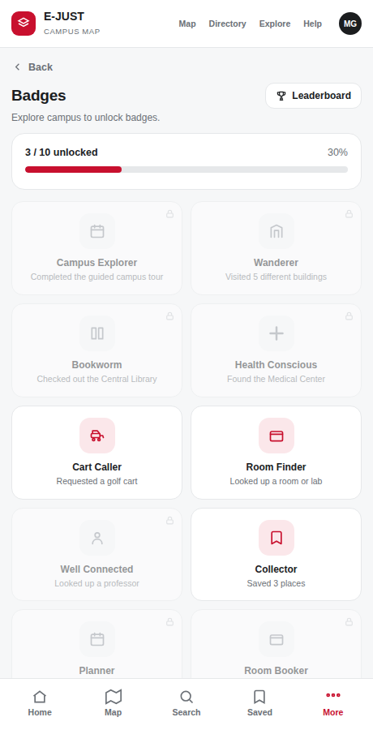
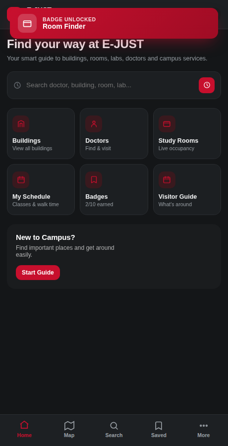

# E-JUST Campus Map

A mobile-first campus wayfinding app for Egypt-Japan University of Science and Technology — interactive map, room/lab/doctor search, turn-by-turn directions, study room booking with live occupancy, class scheduling, and a gamified badge system. Built as a web app, wrapped as a native Android app.

No backend. No build step. State persists to `localStorage`. Open `index.html` and it runs.

<p align="center">
  
  
  
</p>
<p align="center">
  
  
</p>

## Features

**Wayfinding**
- Interactive campus map with real building footprints, category layers (buildings, labs, medical, parking, gates, restrooms, ATMs), zoom, and a live pin legend
- Building → floor → room drill-down, with per-floor room/lab grids and an "Open now" filter
- Turn-by-turn walking directions with distance/time estimates and a live route line on the map
- Golf cart request flow (search → assigned driver/cart/ETA → live tracking bar) as the accessible alternative to walking
- Doctor directory with office hours, location, and one-tap directions to their office

**Study & schedule**
- Study room booking by the hour (group study rooms), with per-slot availability
- Live occupancy tracking with manual or QR-code check-in (simulated camera scan)
- "My Schedule" — add classes manually or paste a timetable in bulk, with a home-screen "starts in X min" widget that turns urgent under 10 minutes
- Real browser push notifications for upcoming classes (`Notification` API on web; native Android notifications when running as the wrapped app)

**Account & gamification**
- Student login / guest mode
- 10 unlockable badges tied to real actions (visiting buildings, booking rooms, requesting carts, etc.), with unlock toasts
- Leaderboard comparing your badge count against other students
- Saved places, recent searches, dark mode, Arabic label toggle, metric/imperial distances — all persisted

## Tech stack

Vanilla HTML/CSS/JavaScript. No framework, no bundler, no dependencies. State is a single in-memory object re-rendered on every change and mirrored to `localStorage`. Routing is a hand-rolled hash-free client-side router (`navigate()` / `render()`) with its own back-stack for native back-button support.

```
├── index.html          # markup + login screen
├── styles.css           # entire design system (~1300 lines)
├── app.js                # entire app: data, state, router, all screens, event handling
└── android/               # native Android Studio project (WebView wrapper, see below)
```

## Running it

Just open `index.html` in a browser. That's it — no server, no `npm install`.

For local development with live reload, any static server works:

```bash
npx serve .
# or
python3 -m http.server 8000
```

## Android

The `android/` folder is a complete, ready-to-open Android Studio project. It's a thin native `WebView` shell around the exact same `index.html` / `styles.css` / `app.js` — not a rewrite. Three things were added specifically to make it behave like a real Android app instead of "a website in a box":

1. **`domStorageEnabled = true`** on the WebView — required for the `localStorage` persistence to actually work.
2. **Native back-button support.** The web app never created real browser history entries (it's all client-side state, not URL navigation), so a small in-page navigation stack (`navHistory` / `goBackInApp()` in `app.js`) was added and wired to Android's back dispatcher.
3. **Real Android notifications for class reminders.** The web `Notification` API doesn't work on `file://` pages, so a small Kotlin bridge (`AndroidNotificationBridge`) is exposed to JS as `window.AndroidBridge`; `app.js` checks for it and posts a real system notification when present, falling back to the standard web behavior otherwise.

### Opening the project

1. Android Studio → **Open** → select the `android/` folder
2. Let Gradle sync (if it flags a missing wrapper jar, that's normal for a hand-built project — Android Studio will offer to generate it, or run `gradle wrapper` once)
3. Run (▶ or Shift+F10) — `minSdk` 26 (Android 8.0+)

```bash
./gradlew assembleDebug
# APK lands in android/app/build/outputs/apk/debug/
```

## Known limitations

Being upfront about what this is and isn't:

- **Login is fake.** Any username/password is accepted — there's no backend, no real auth. It exists to drive the badge/schedule/persistence features, not for actual account security.
- **QR check-in is simulated.** It's a canned scan animation, not a real camera/ML Kit reader.
- **Golf cart requests, doctor availability, and room occupancy are fabricated data**, not live campus systems.
- **Fonts need connectivity.** Google Fonts are loaded from a CDN; offline, it falls back to the system font stack (already handled in CSS — nothing breaks, it just looks slightly different).
- **State is per-browser/per-device**, not synced to any account or server. Clearing site data / app data wipes everything (there's a "Reset Prototype Data" button in Settings for exactly this).

## Roadmap ideas

Real indoor room-to-room turn-by-turn (waypoint graph per floor), QR-checkpoint-based route confirmation, a security/incident-reporting view, and actual camera-based QR scanning are the natural next steps — see [Issues](../../issues) if this repo has any open.

## License

MIT — do whatever you want with it.
